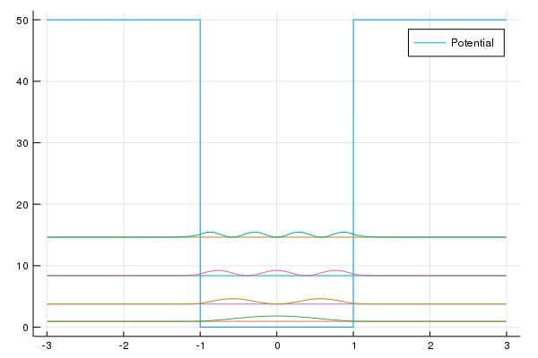

# Quantum Stories
Implementation of some simple Quantum systems in Julia

## FDschemes.jl
Calculates the eigenstates and energys of some simple Quantum Mechnical systems using finite difference schemes. Then the probablility densities are plotted with respect to their energies. As expected, the results get more incorrect with higher energies.

## MonomialsHO.jl
Calculates the energies of the Harmonic Oscillator using an taylor series. As expected the results are super bad. More a Proof-of-Concept.

## LegendreHO.jl
Calulate the energies of the Harmonic Oscillator using Legendre Polynomials. The method is basicaly the same already used in MonomicsHO.jl. But this time the results are far better because of orthogonality of the legendre polynomials.

