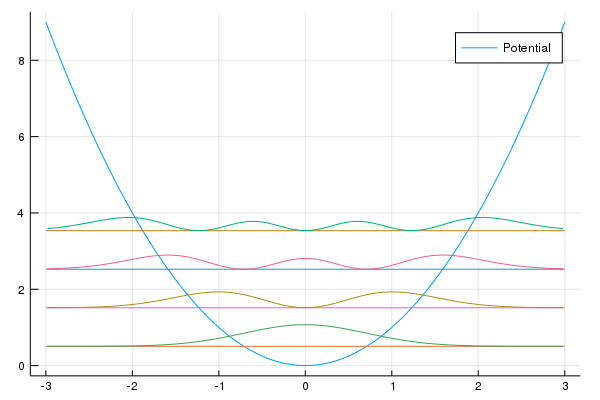

# Quantum Stories
Implementation of some simple quantum systems in Julia

## FDschemes.jl
Calculates the eigenstates and energies of some simple quantum systems using finite difference schemes. Then the probablility densities are plotted with respect to their energies.

## MonomialsHO.jl
Calculates the energies of the Harmonic Oscillator using an taylor series. The monomials are used as an basis set for the hilbert state then the operators are expressed in terms of the choosen basis set. E.g. H_ij = <x^i| H | x^j>. This method does not produce good results, since the monomials are not a linear independet basis.

## LegendreHO.jl
Calulates the energies of the Harmonic Oscillator using Legendre Polynomials. The method is basically the same as already used in MonomicsHO.jl. The integration is done using Gauss-Legendre quadrature rules. The eigenvectors of this problem are the coefficients to the legendre polynomials. Plots of the probability densities are given in the figure below.
